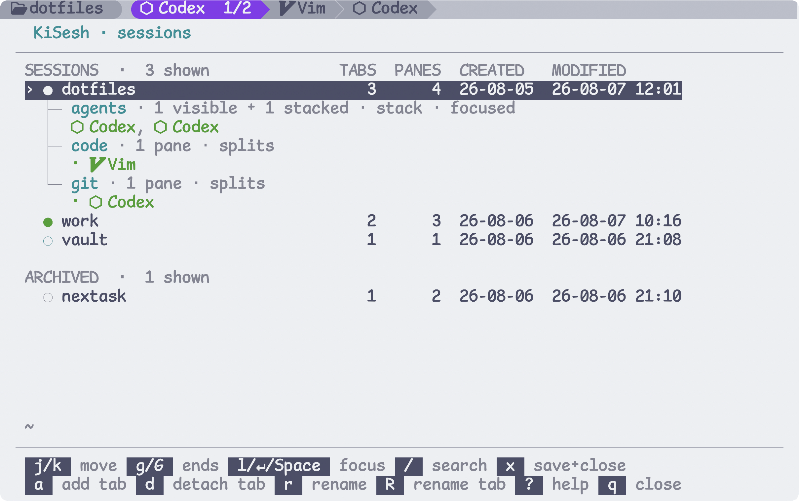

# KiSesh

[](https://sw.kovidgoyal.net/kitty/)
[](https://www.python.org/)
[](https://www.apple.com/macos/)
[](LICENSE)

Kitty-native, recoverable sessions **without** a terminal multiplexer.



KiSesh groups native Kitty tabs and panes into named sessions.

> [!NOTE]
> KiSesh does **not** preserve the in-memory state of running processes.


### Features

- Provide `live`, `saved`, `archived` session states
- Autosave: layout, terminal context, and commands
- Session recovery (see `apps.toml` for configuring)
  - bring back history up to 2000 lines
  - rerun **recognized** last running command
  - prefill **unrecognized** commands and arguments without executing them
  - auto resume `codex`, `claude` sessions

> [!IMPORTANT]
>
> Enable `claude` and `codex` session recovery via adding the hooks:
>
> ```sh
> kisesh agents enable
> ```
>
> Inspect it with `kisesh agents status`; remove it with `kisesh agents disable`.

## Install

**requirements**

- [Kitty](https://sw.kovidgoyal.net/kitty/) >= 0.47.2
- Nerd Font

```sh
curl -LsSf https://raw.githubusercontent.com/TolgaOk/kisesh/v0.1.2-beta/install.sh | sh
```

Using `uv`:

```sh
uv tool install --python 3.11 https://github.com/TolgaOk/kisesh/archive/refs/tags/v0.1.2-beta.tar.gz
kisesh install
```

Restart Kitty after either installation method, then press `Alt+S` to open the KiSesh session manager.

## Configuration

Session data is stored locally in `~/.local/share/kisesh/` by default.

`kisesh install` creates `~/.config/kisesh/apps.toml` from the
[bundled defaults](kisesh/default_apps.toml). Existing configuration is kept.

```toml
[defaults]
restore = "prefill"
label = "App"
icon = ""

[apps.nvim]
match = ["nvim", "nvim-*", "vim", "vi"]
restore = "captured"
label = "Vim"
icon = ""

...
```
