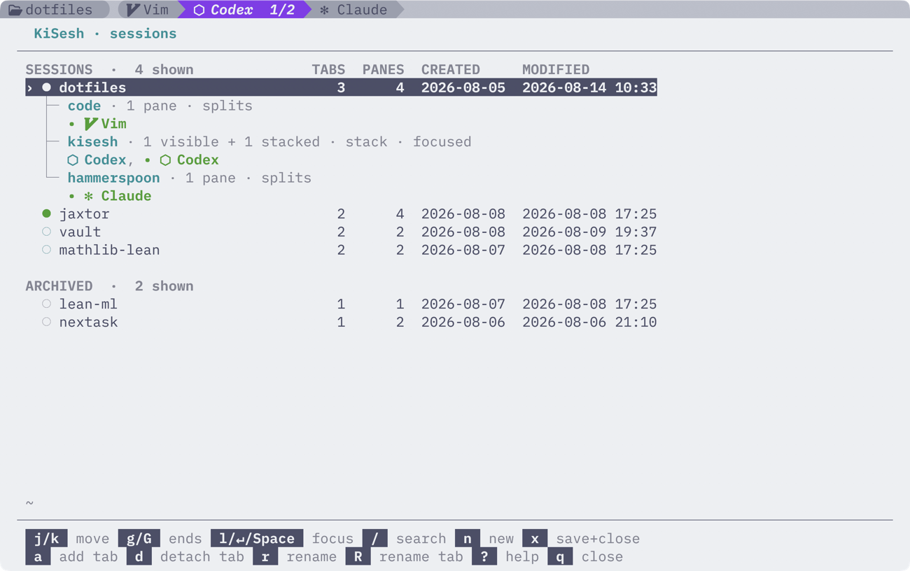

<picture>
  <source media="(prefers-color-scheme: dark)" srcset="docs/kisesh-logo-dark.svg">
  <source media="(prefers-color-scheme: light)" srcset="docs/kisesh-logo-light.svg">
  
</picture>

[](https://sw.kovidgoyal.net/kitty/)
[](https://www.python.org/)
[](https://www.apple.com/macos/)
[](LICENSE)

KiSesh is an extension for the

[Kitty](https://sw.kovidgoyal.net/kitty/) terminal emulator providing lightweight session redesign.
It uses Kitty's native tabs, panes, overlays, watchers, and remote control, with **no** terminal multiplexer.

<picture>
  <source media="(prefers-color-scheme: dark)" srcset="docs/kisesh-dark.png">
  <source media="(prefers-color-scheme: light)" srcset="docs/kisesh-light.png">
  
</picture>

Above is a screenshot of the KiSesh session panel (press `Alt+s` to open it).
This is a Kitty overlay panel for managing KiSesh sessions.

> [!NOTE]
> KiSesh does **not** preserve the in-memory state of running processes.


### Features

Below is the list of features KiSesh provides.

- Session recovery (see `apps.toml` for configuring)
  - bring back history up to 2000 lines for each pane
  - rerun **recognized** last running command
  - prefill **unrecognized** commands and arguments without executing them
  - auto resume `claude`, `codex`, and `pi` sessions (if enabled)
- `● live`, `○ saved`, and `○ archived` session states
- Autosave when change in: layout, terminal context, or command execution
- Attach or detach a tab to/from a session


## Install

**Requirements**

- [Kitty](https://sw.kovidgoyal.net/kitty/) >= 0.47.2
- Nerd Font

```sh
curl -LsSf https://github.com/TolgaOk/kisesh/releases/latest/download/install.sh | sh
```

Using `uv`:

```sh
uv tool install --python 3.11 \
  https://github.com/TolgaOk/kisesh/releases/latest/download/kisesh.tar.gz &&
  kisesh enable
```

Restart `Kitty` after either installation method, then press `Alt+S` to open the
KiSesh session manager.

> [!IMPORTANT]
>
> To enable agent session recovery add hooks with:
>
> ```sh
> kisesh agents enable
> ```
>
> Inspect the hooks with `kisesh agents status`; remove them with `kisesh agents disable`.

Manage Kisesh from the same CLI:

```sh
kisesh enable
kisesh disable
kisesh uninstall
```

`enable/disable` enables or disable KiSesh.
`uninstall` removes KiSesh (`--purge` for removing the session data).

## Configuration

Session data is stored locally in `~/.local/share/kisesh/` by default.

```toml
version = 2

[defaults]
restore = "prefill"
label = "App"
icon = ""

[agents.claude]
match = ["claude", "claude-*"]
restore = "resume"
adapter = "claude"
label = "Claude"
icon = "✻"

[apps.nvim]
match = ["nvim", "nvim-*", "vim", "vi"]
restore = "captured"
label = "Vim"
icon = ""

# ...
```
